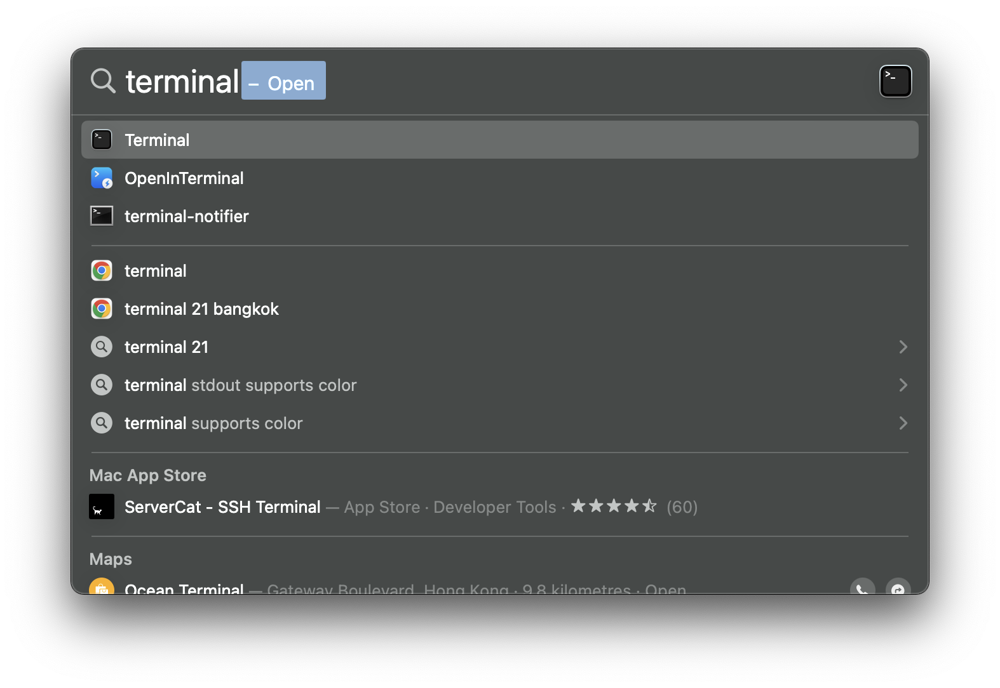
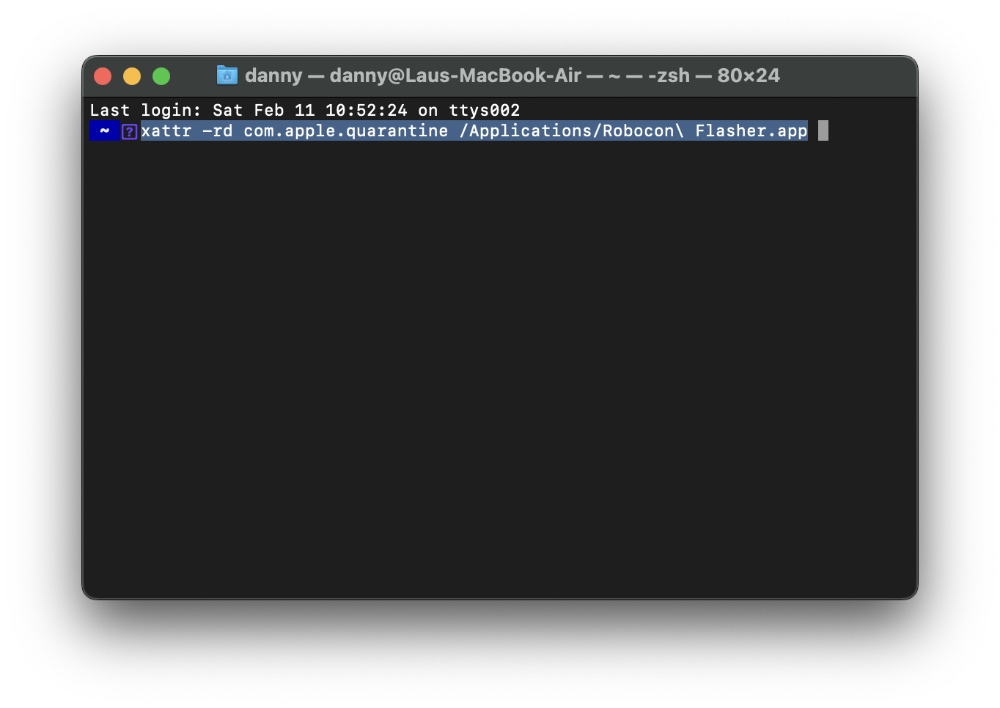

# Installing Flasher

This page provides guideline on installing the flasher into your computer.

## macOS

1. Download the flasher from the below.
   - [Apple Scilion](https://github.com/HKUST-Robocon/robocon_flasher/releases/latest/download/flasher_installer_apple_scilion.dmg)
   - [Intel Chip](https://github.com/HKUST-Robocon/robocon_flasher/releases/latest/download/flasher_installer_intel_chip.dmg)
2. Open the downloaded dmg.
3. Drag the app icon to the application folder.
4. Open "Spotlight", and enter "terminal" to open the terminal app.
   
5. In the terminal, enter the following:
   ```bash
   xattr -rd com.apple.quarantine /Applications/Robocon\ Flasher.app
   ```
   
6. Now you close the terminal app and run the flasher.


## Windows

1. Download the flasher from [here](google.com).
2. Double click the downloaded installer, and follow the instruction to install it.