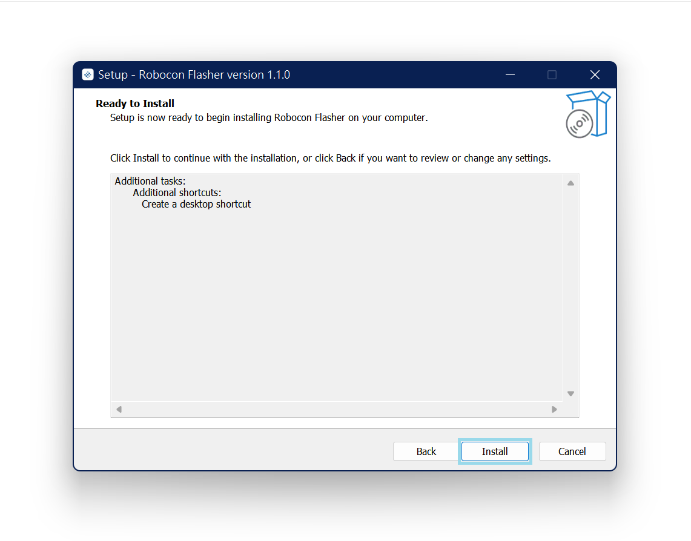

# Installing Flasher

This page provides guideline on installing the flasher into your computer.

## macOS

1. Download the flasher from the below.
   - [Apple Scilion](https://github.com/HKUST-Robocon/robocon_flasher/releases/download/v1.0.1-application/flasher_installer_apple_scilion.dmg)
   - [Intel Chip](https://github.com/HKUST-Robocon/robocon_flasher/releases/download/v1.0.1-application/flasher_installer_intel_chip.dmg)
2. Open the downloaded dmg.
3. Drag the app icon to the application folder.
4. Open "Spotlight", and enter "terminal" to open the terminal app.
   
5. In the terminal, enter the following:
   ```bash
   xattr -rd com.apple.quarantine /Applications/Robocon\ Flasher.app
   ```
   
6. Now you close the terminal app and run the flasher.


## Windows

1. Download the flasher from [here](https://github.com/HKUST-Robocon/robocon_flasher/releases/download/v1.0.1-application/flasher_installer_windows.exe).
2. Click the downloaded installer to open the `.exe` file
   
3. After the setup page pop out, click **Next**.
   
4. Click **Install** to start install the application.
   
5. Follow the instructions to install it, the installation process should be the same as for normal Windows applications.
