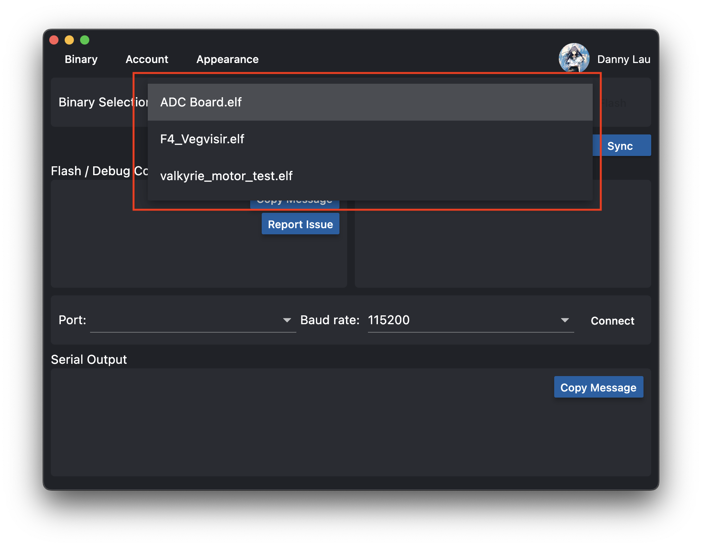
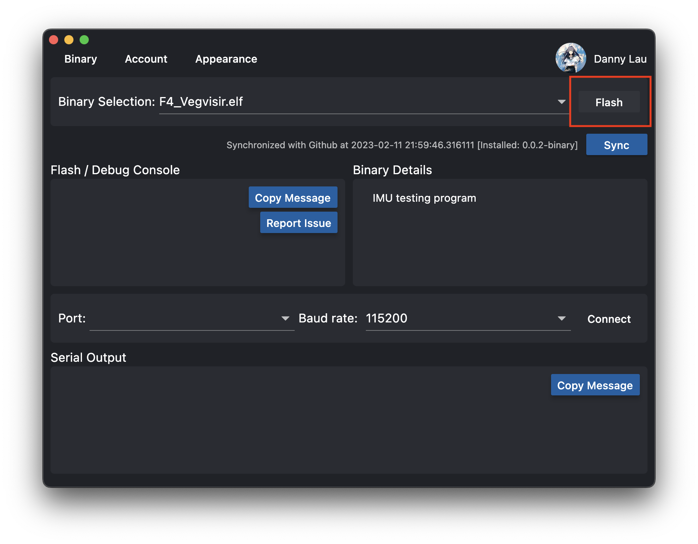
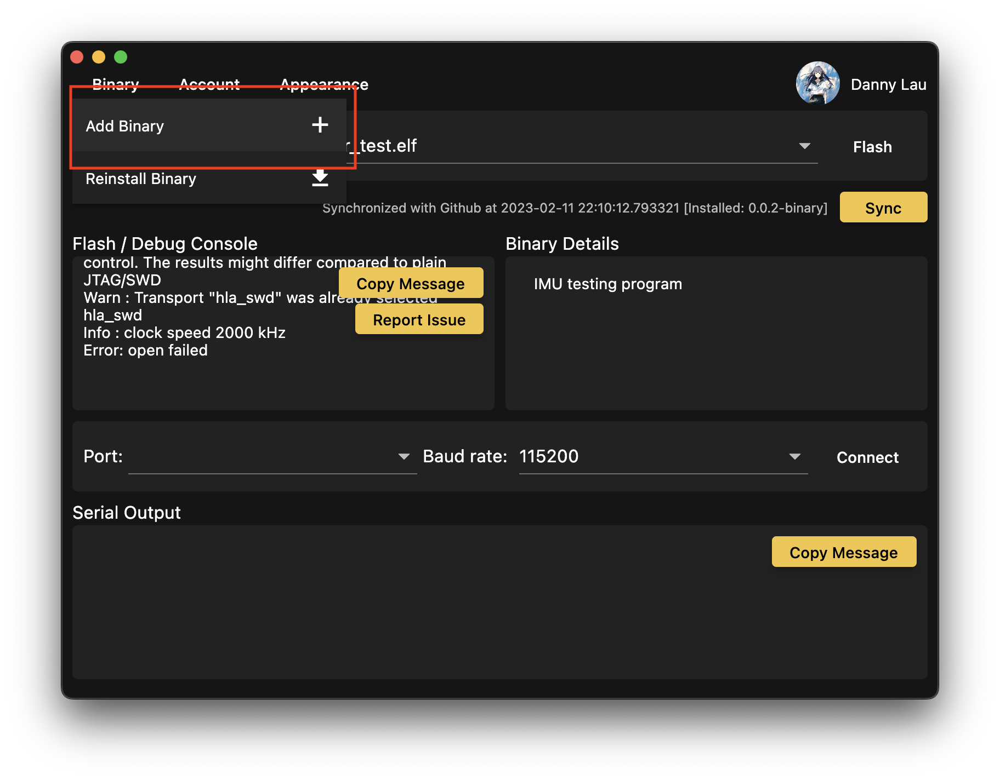
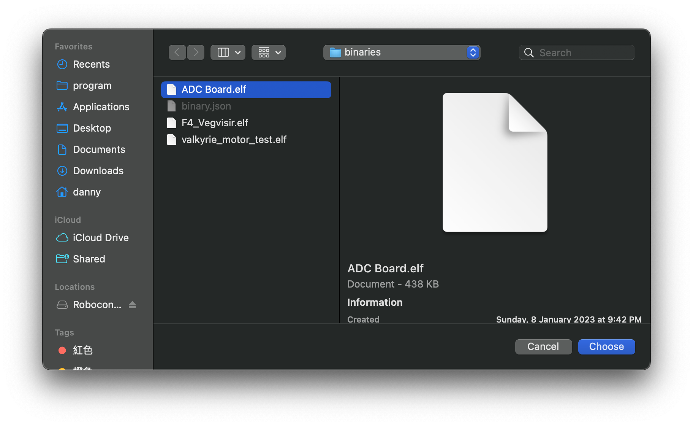
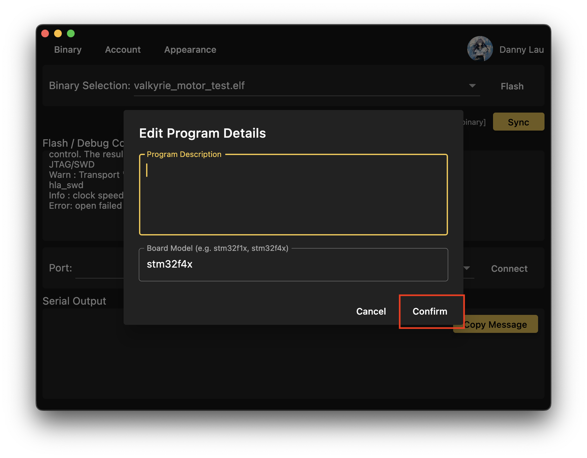

# Flashing Programs

The flasher offers lots of programs which are already pre-compiled. These programs are maintained by the software team and will update to newer version if needed. You can also load your own programs and flash it via the flasher.

## Flashing Pre-installed Programs

1. Click the dropdown button and select the program.
   
2. Once you selected a program, the flash button will be enabled. Click "flash".
   
3. You will see an output likes "Attempts to flash xxxxx.elf". That means the flasher is flashing your program.
4. A flashing report will be generated after a few seconds, please read the report for more details.

## Flashing Your Own Programs

Besides from the pre-installed programs, you can load your own program into the flasher.

To load your programs, follow below:

1. On "Binary", select "Add Binary".
   
2. Select your compiled program from the file explorer.
   
3. Edit the program details. After your finished editing, click "confirm".
   

   :::info Can I use markdown syntax for writing "Program Description"?
   Yes, to provide bettering formatting for the description, the flasher supports markdown syntax by default.
   :::

   :::info What is broad model?
   Your program usuallys compiles with the hardware configuration - that means the program is only designed for the particular model.

   To flash the program smoothly without any error, the flasher needs to know the target broad model, otherwise the flashing operation could fail.
   :::

Now the flasher has loaded your program, and you can find your program from the dropdown button.