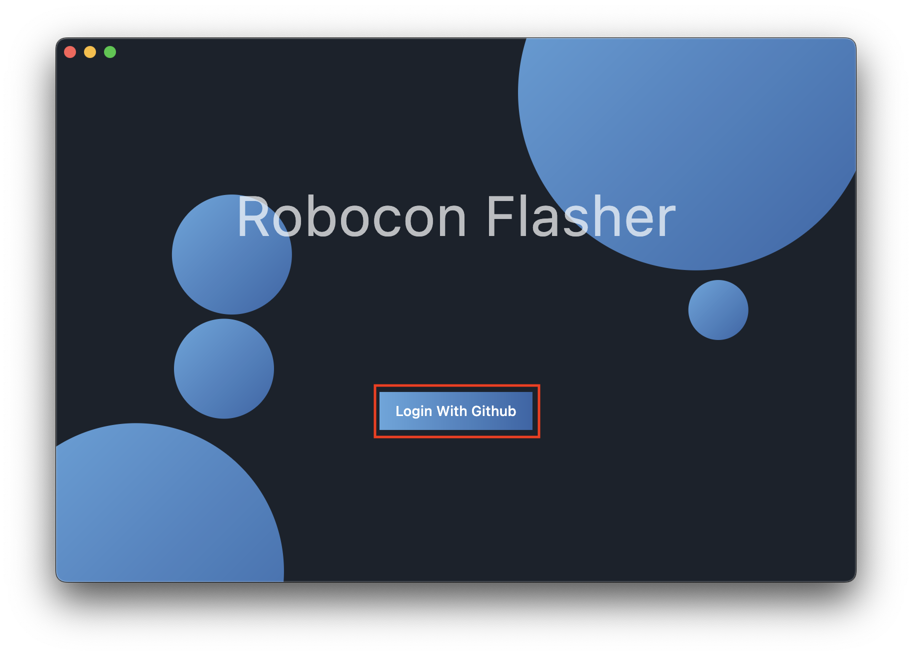
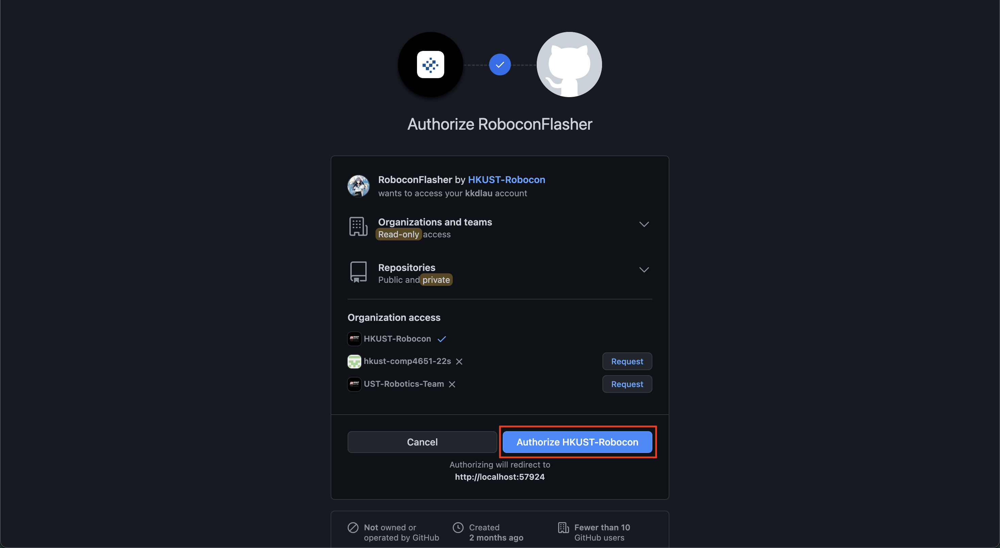
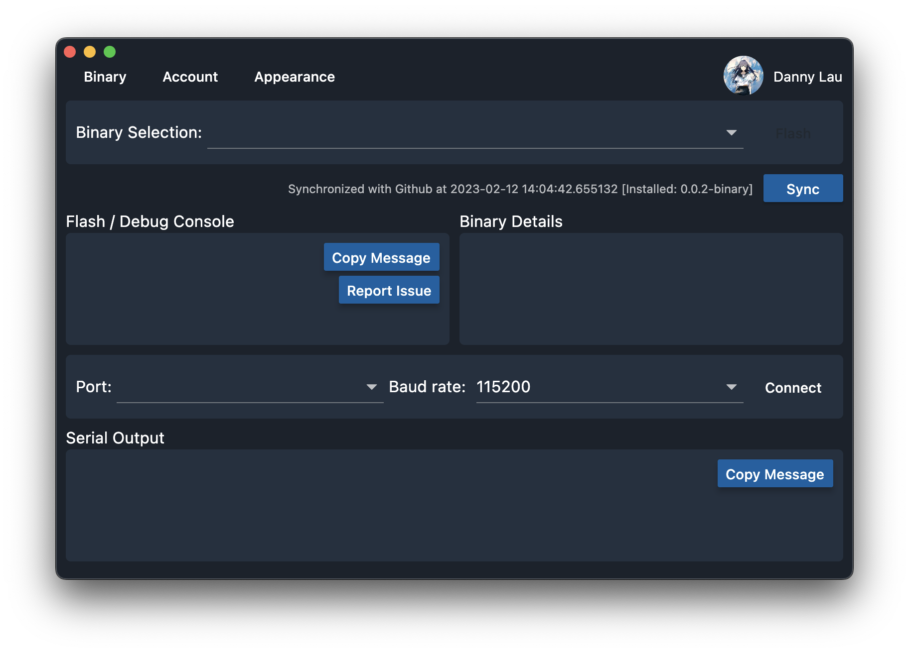
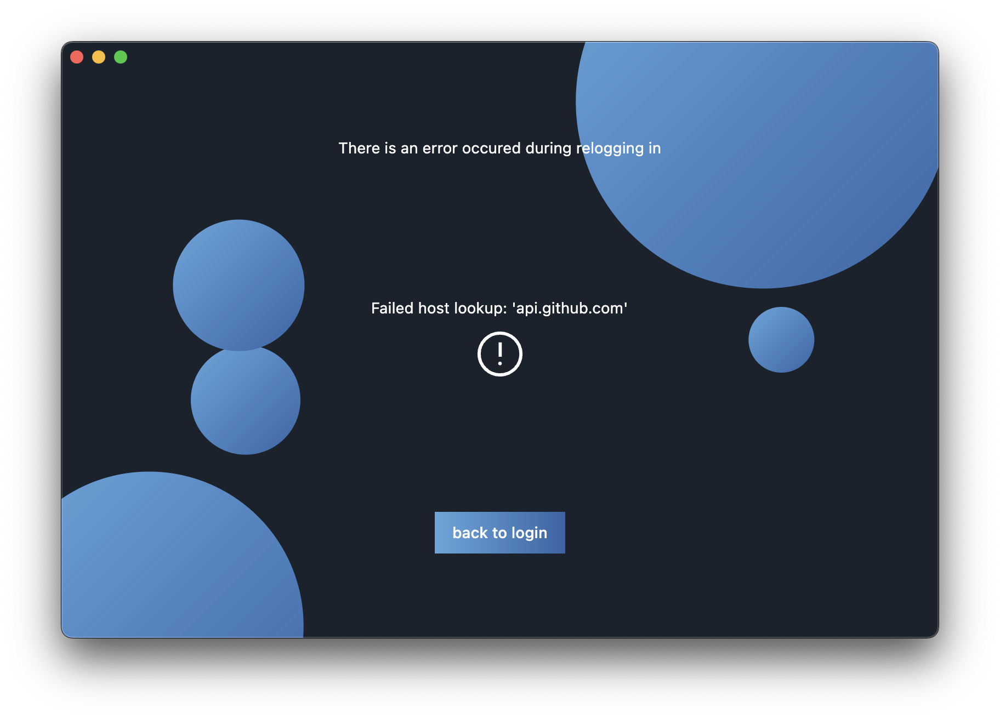

# Opening Flasher

The flasher works closely with GitHub. In order to enable all features, you must login with your GitHub account.

## First Time Opening Flasher

1. Click "Login with GitHub".
   
2. Click "Authorize".
   
3. If the login operation is successful, you will be redirected to the home page.
   

## Reopening Flasher

By default, the flasher saves your access token internally so you do not need to login every time you reopen the flasher.

However, if some situations the relogging operation failed (e.g. password updated, network failure):

In this case, you must login again from the login page.