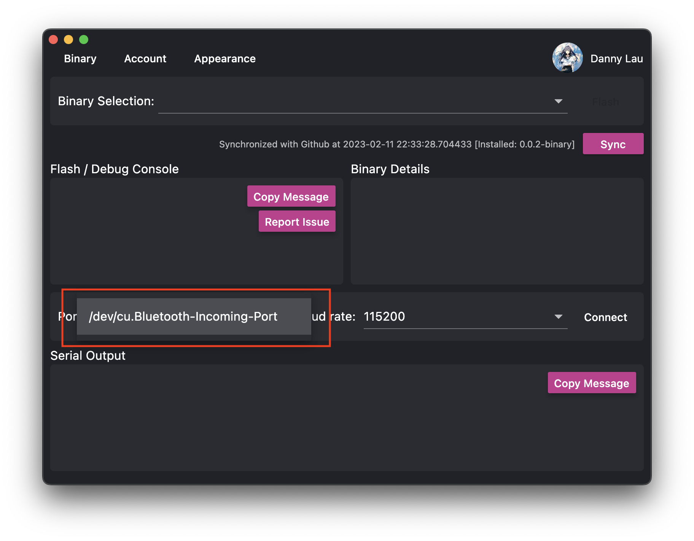
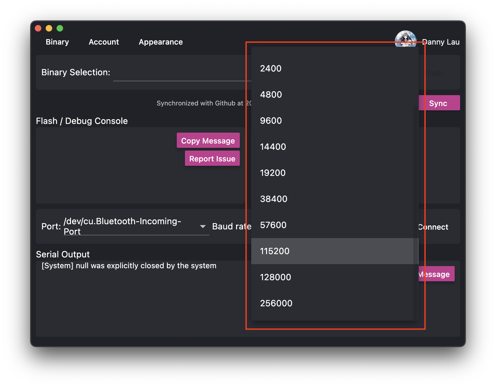
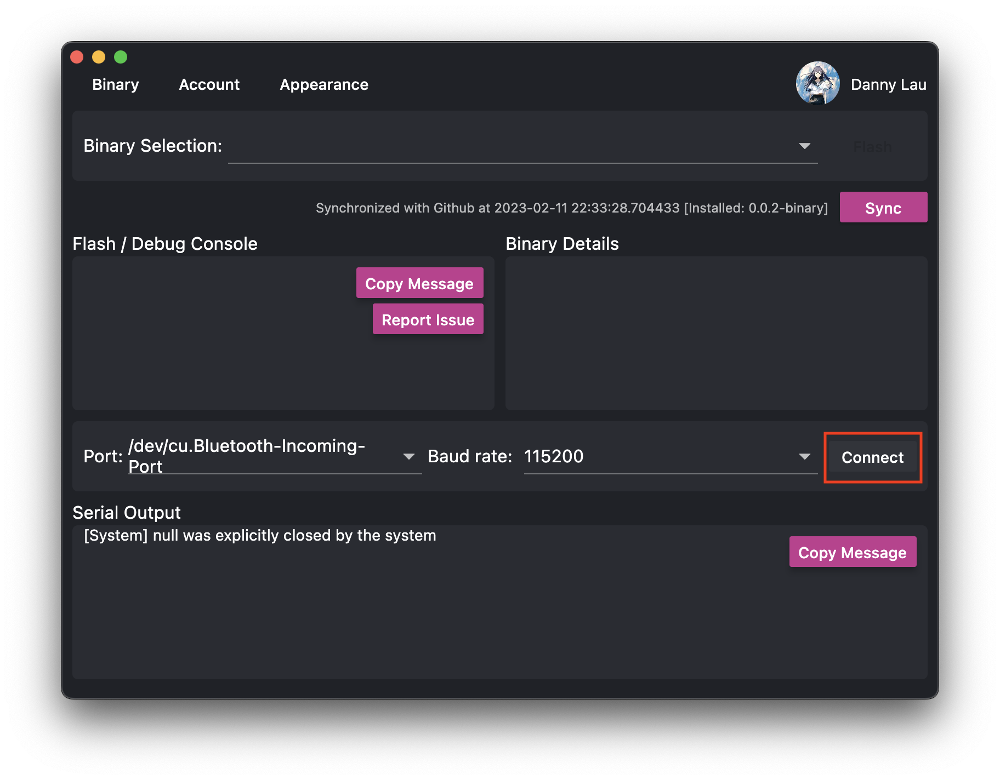

# Reading From Serial Port

The flasher is not just limited to flashing programs, but also able to debug your programs via the serial ports.

To read from the serial port:

1. Select the serial port you want to read.
   
2. Select the target baud rate.
   

  :::caution be careful on selecting baud rate!
  The target baud rate is determined by the UART port that you are connecting to. Please refer to the board program description for more details.
  :::

3. Click "connect".
   

Once you connect to the port, you will the serial output from the console.