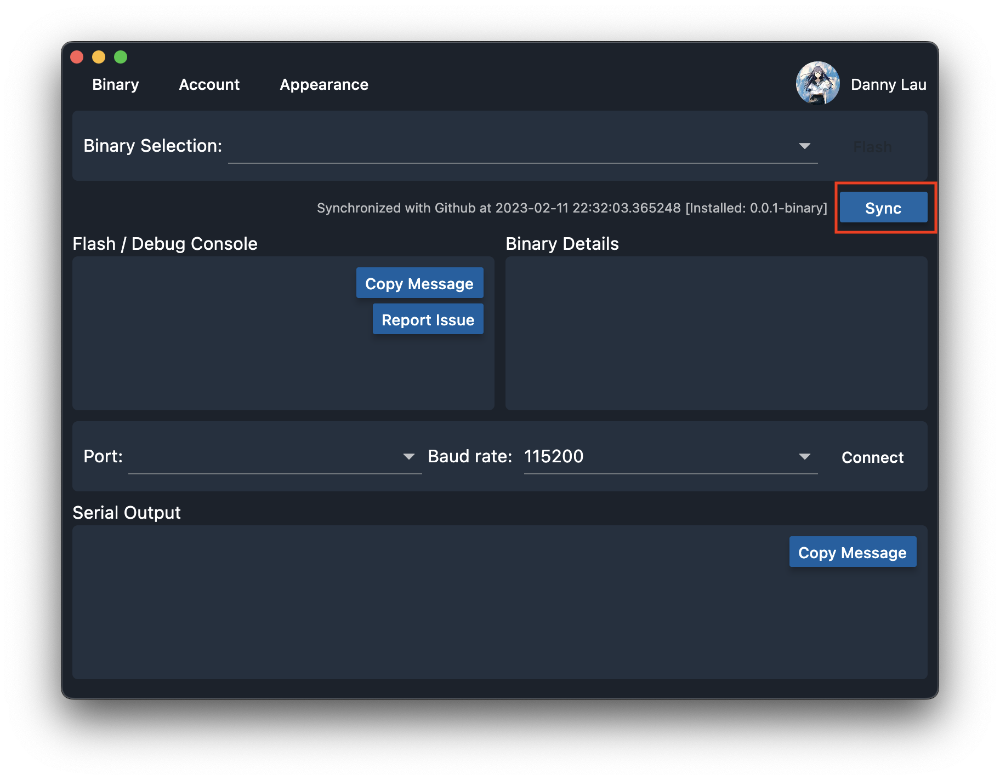
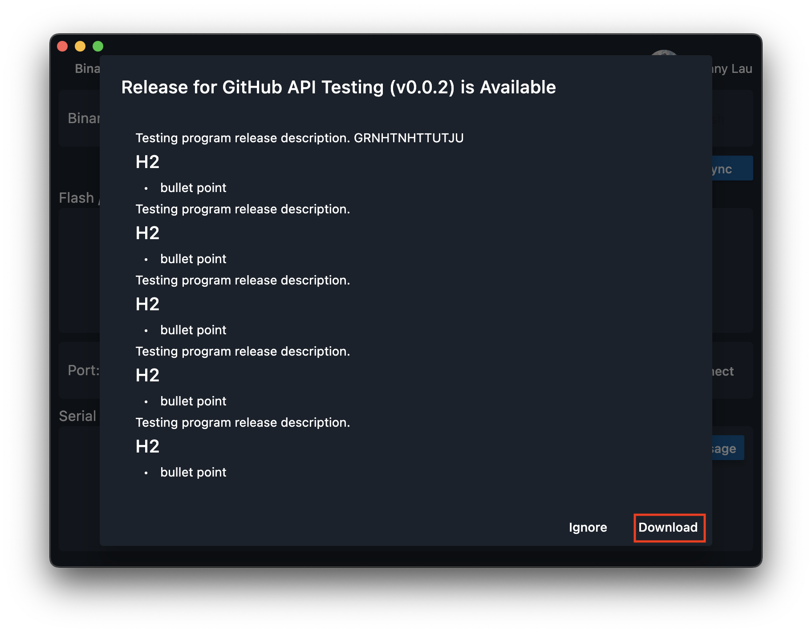

# Updating Programs

The software team will publish new testing programs in GitHub and you may want to install the new testing programs. By default, the flasher will synchronize with the GitHub for every 15 minutes and remind the user if there is a new release.

To manually check for the updates:

1. Click "Sync" to check the updates.
   
2. In case there is a new version of release, the flasher will pop up a dialog.
3. Click "Download".
   
4. You will be redirected to the download page.
   

Once the download is finished, the flasher will deploy the new test programs and redirect back to the home page.